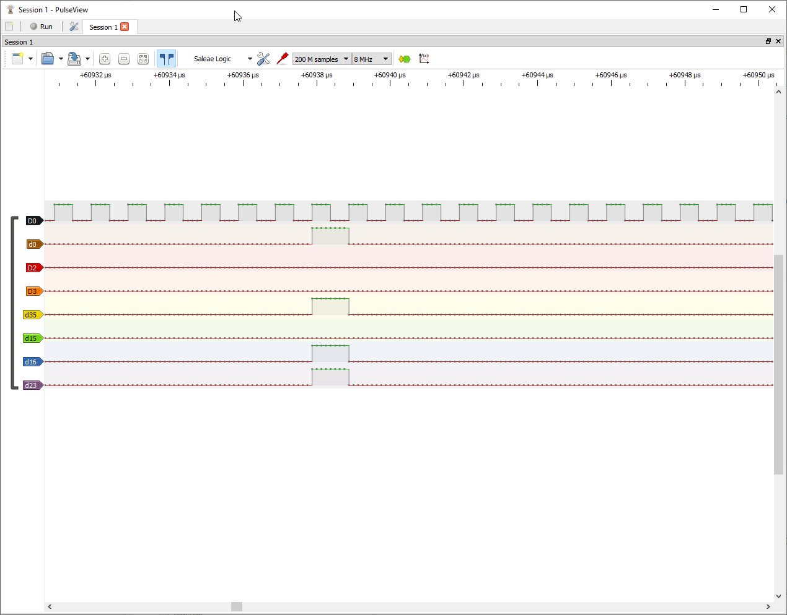

# esp32s2-24bit-i2s-lcd-parallel
 Example of sending 24 bits in parallel using ESP32S2 I2S LCD interface
 
 When looking at pulseview on certain GPIO's that are allocated to certain 'bits' of each 3 bytes that are clocked out in parallel, you will see:
 
 

This is an arbitrary output as a result of:
```
      global_buffer[75] = 0b1; // byte 1
      global_buffer[76] = 0b01000000; // byte 2
      global_buffer[77] = 0xff; // byte 3
```

Refer to `esp32s2_i2s_lcd_parallel_dma.cpp`

The GPIO to 'bit position' mapping for this example is as follows for testing:
```
  bus_cfg.pin_d0 = GPIO_NUM_40;
  bus_cfg.pin_d1 = GPIO_NUM_37;
  bus_cfg.pin_d2 = -1;
  bus_cfg.pin_d3 = -1;
  bus_cfg.pin_d4 = -1;
  bus_cfg.pin_d5 = -1; // blue
  bus_cfg.pin_d6 = -1;
  bus_cfg.pin_d7 = -1;
  bus_cfg.pin_d8 = GPIO_NUM_38; // start of second byte
  bus_cfg.pin_d9 = -1;
  bus_cfg.pin_d10 = -1;
  bus_cfg.pin_d11 = -1;
  bus_cfg.pin_d12 = -1;
  bus_cfg.pin_d13 = -1;
  bus_cfg.pin_d14 = GPIO_NUM_35;  
  bus_cfg.pin_d15 = GPIO_NUM_36; // end of byte 2
  bus_cfg.pin_d16 = GPIO_NUM_33; // start of third byte
  bus_cfg.pin_d17 = -1;
  bus_cfg.pin_d18 = -1;
  bus_cfg.pin_d19 = -1;
  bus_cfg.pin_d20 = -1;      
  bus_cfg.pin_d21 = -1;        
  bus_cfg.pin_d22 = -1;          
  bus_cfg.pin_d23 = GPIO_NUM_34;  // end of third byte
```
