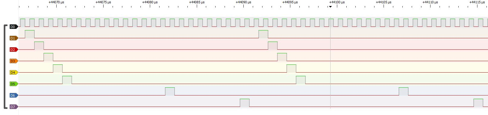

| Supported Targets |  ESP32-S2 |
| ----------------- |  -------- | 

# ESP32-S2 24bit LCD DMA output from PSRAM
This is an example of outputting 24bits of data in parallel from PSRAM / SPIRAM via the LCD interface.

This esp-idf sketch has been written for the ESP32-S2 only. Specifically the WeMos [ESP32-S2 Mini, or equivalent clones](https://www.wemos.cc/en/latest/s2/s2_mini.html). 

## How does this work?
The biggest issue with using PSRAM is "cache coheriency" or something to do with the fact that there's a buffer between the CPU and the PSRAM when writing to it, but NOT when reading from it via DMA.

So there's the risk of stuff you write to PSRAM not actually being written as it's sitting in the cache, so the DMA read-out is incomplete.

Extensive use of `Cache_WriteBack_Addr` resolves for this when doing PSRAM write functions.

When using PSRAM on the ESP32-S2 Mini, output clock rate seems to hit a limit at only 1Mhz! After this it is likely the DMA transfer will fail, probably due to the fact the PSRAM is very low throughput.

## Example output as seen in pulseview

Using an 8 channel logic level analyser of bits d0-d6, d15 and d23 (the msb).



## Disabling PSRAM use
Comment out the following define line in esp32s2_i2s_lcd_24bit_parallel_dma.hpp to simply use the normal internal (and limited) SRAM. You will then be able to use MUCH faster output clock speeds.
```
#define USE_REAL_SLOW_PSRAM 1
```